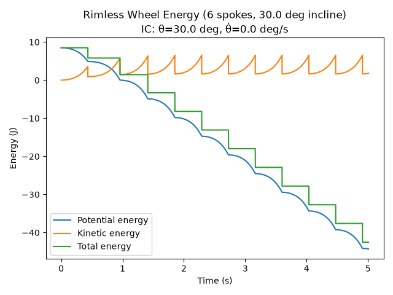
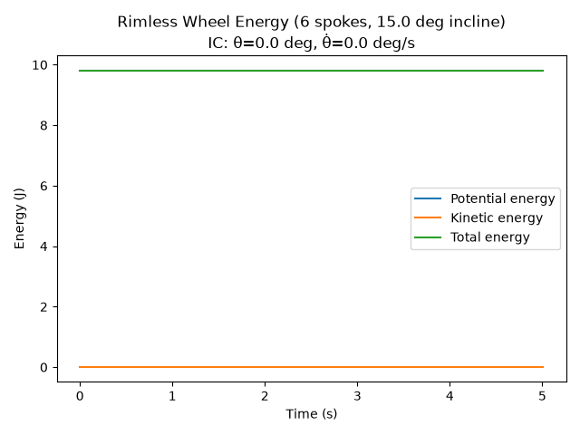
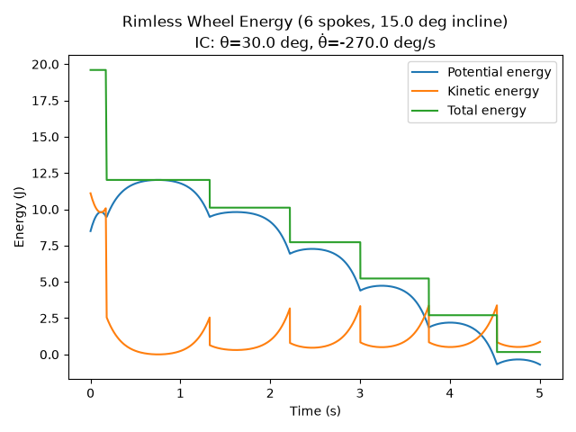
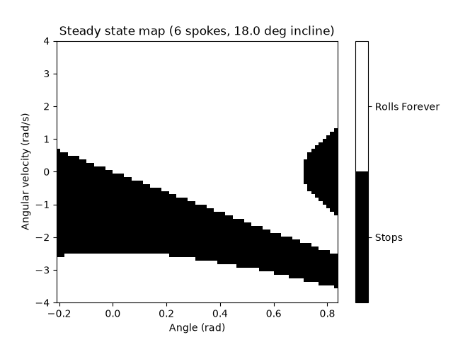
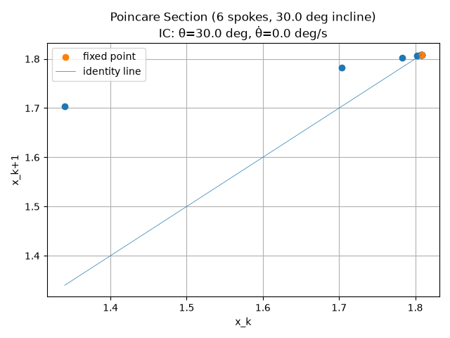
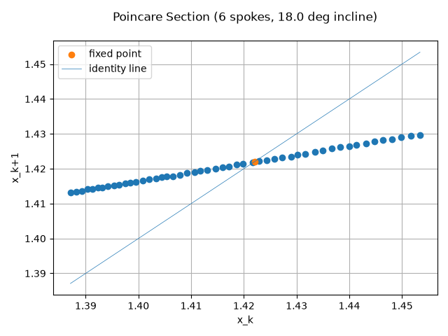
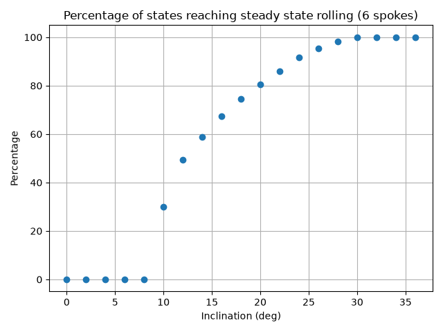
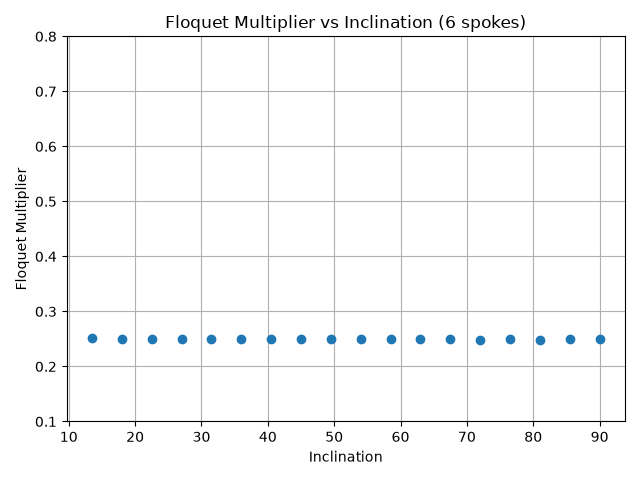
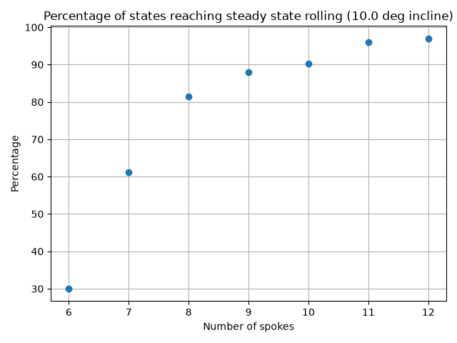
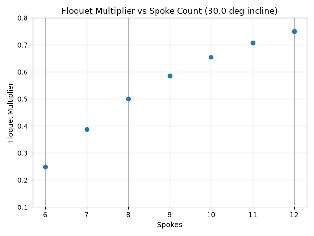

How to run code:
All adjustable parameters/setting should at the top of rimlessWheel_main_file.py and can be adjusted to simulate the desired system. Toggling 0/1 at the top of the script allows you to pic what sections to run/plots to create. All the RoA sections take a while to run, so existing data is saved and plots can be created without re-running. Bounds and resolution for sweeping sections are adjusted within each section.

rimlessWheel_main_file.py: main file to adjust and run everything from
models/rimlessWheel: contains functions for dynamics, full integration, and other analysis
integrators/rk4: function for integrating one step
data: where RoA values are saved to allow plotting w/o re-running
figures: where plots are saved

**Sanity Checks**
1. I expected to see a sharp decrease in kinetic(and potential energy) at each impact, with energy being conserved between impacts

    - This matched what I observed in the following energy plot

2. I expected simulations starting with theta = 0 and no angular velocity to remain stationary for all time.
    - This matches the unchanging energy plot below

3. I expected simulations starting with negative angular velocity to still eventually roll downhill/not roll uphill forever
    - This matches the following plot, where potential energy can be seen to increase initially, before settling into a decreasing pattern

**State Space RoA plot**

I expect 2 attractors:
- steady rolling behavior, where motion is periodic and theta dot after each impact is identical
- stable stationary position with theta = slope + alpha. This represents the wheel resting on two spokes and exists if alpha > slope. Otherwise, there is no resting position where the COG is between the contact points of the two spokes.
    - If alpha > slope, there is also an unstable equilibrium position with theta = 0

The following plot shows the states that converge to each attractor. It indicates a band of states (in black)that end up losing velocity with each impact cycle and never reach the impact velocity corresponding to steady rolling, and converge on the stable position (0.84,0), which is also equivalent to (-0.21,0). The pocket to the center left corresponding to states starting near the stable stationary position, also converges to the stationary state, with the discontinuity between the right and left edge being due to the step loss in energy experienced when crossing over.

**Return Map plot**

For 6 spokes and an incline of 30 degrees, the post-impact angular velocity converged to 1.8083 rad/s. This plot shows the post-impact velocity starting at a lower than that of steady rolling, and increasing semi-linearly with each impact until it converges on the fixed point velocity.

A starting condition with a higher initial impact velocity results in the opposite trend, where velocity is gradually reduced until it converges on the fixed point from above. 

**Effect of inclination on RoA and local convergence**

For a 6-spoke wheels, a RoA attractor sweep was performed from 0-36 degrees of inclination. States covering initial angles within the possible range of theta for a 6 spoke wheel and initial velocity from -4 to 4 rad/s were evaluated. The resulting percentage of states converging to a steady state rolling was plotted as a function of inclination.
        - The percent of states converging to steady rolling is shown to increase with inclination. A steep initial increase in percentage is observed from 8 degrees (0%) and 10 degrees (~30%), resembling a sort of tipping point. The increase in rolling % tapers off as it nears 100% at an inclination of 30+ degrees.
    

A similar sweep of Floquet multipliers was performed from 0-90 degrees. For inclinations capable of producing steady state rolling, the Floquet multiplier was found to be a constant 0.25 for all angles (plus or minus some noise). This suggests that the stability/convergence onto the attractors is independent on inclination

**Effect of spoke count on RoA and local convergence**
For a 15 degree inclination, an RoA sweep was performed on spoke counts from 6 to 12, for the same state range as listed above. The percent of states reaching steady rolling was observed to increase with spoke count, matching intuition, as an increase in spoke count correspons with a closer approximation of a circular wheel, which rolls for all states.

A Floquet multiplier sweep across spoke counts for shows an increase in increase in multiplier value with increasing spoke count. This corresponds to a smaller loss in energy per impact and slower convergence onto the fixed point velocity. This matches intuition, as a wheel with infinite spokes does not converge on a fixed point and should have zero impacts/loss of energy, corresponding with an multiplier of 1.

